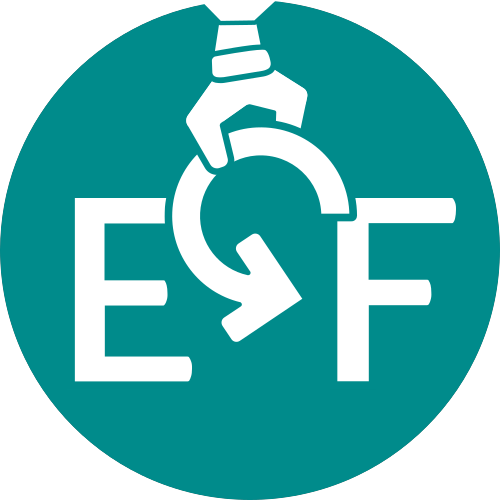

<p align="center">

</p>

# DNA Mutator


[](https://github.com/Edinburgh-Genome-Foundry/Mutator/actions/workflows/build.yml)

Create variants of DNA sequences.

This repository is based on the software code of a dissertation project (B237870) for the MSc Bioinformatics program at the University of Edinburgh.

## Install

```bash
pip install git+https://github.com/Edinburgh-Genome-Foundry/mutator.git
```

## Usage

```python
import dna_mutator as mutator
record = mutator.Mutator.read_genbank("EGF.gb")
mut = mutator.Mutator(record)
mut.DelN()
mut.write_all_records("variants")
```

## Versioning

DNA Mutator uses the [semantic versioning](https://semver.org) scheme.

## License = MIT

DNA Mutator is free/libre and open-source software, which means the users have the freedom to run, study, change and distribute the software.

DNA Mutator was written at the [Edinburgh Genome Foundry](https://edinburgh-genome-foundry.github.io/)
by [B237870](https://github.com/B237870-2024) and [Peter Vegh](https://github.com/veghp).

Copyright 2024 Edinburgh Genome Foundry, University of Edinburgh
